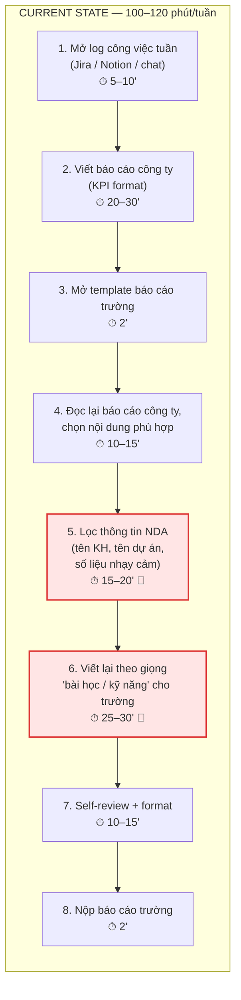
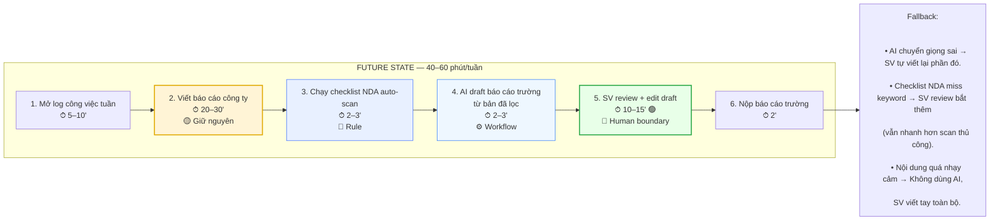

# 02 — Group Problem Statement

---

## Phase 3 — Group Convergence

### Bước 3.1 — Trình bày top 3

Nhóm 4 người, mỗi người share top 3. Tổng cộng 12 candidates.

| #   | Người đưa ra | Candidate problem                                                              | Người gặp vấn đề          | Điểm nghẽn                                   | Cảm nhận nhanh                                                                                                                          |
| -----| --------------| --------------------------------------------------------------------------------| ---------------------------| ----------------------------------------------| -----------------------------------------------------------------------------------------------------------------------------------------|
| 1   | Văn Công     | SV mới chưa thành thạo GitHub, Teams, Outlook, Discord, V-App                  | Sinh viên mới             | Phải tự mò nhiều tool cùng lúc               | Workflow rõ, lặp hàng tuần                                                                                                              |
| 2   | Văn Công     | SV mới gặp quá nhiều keyword AI mới và khó hiểu                                | Sinh viên mới, GVHD       | Hiểu bài khó, ảnh hưởng thảo luận            | Pain sát buổi học                                                                                                                       |
| 3   | Văn Công     | SV mới khó theo dõi thông báo và deadline vì thông tin nằm trên nhiều nền tảng | Sinh viên mới             | Bỏ sót thông báo, trễ deadline               | Nhiều SV gặp, lặp hàng ngày                                                                                                             |
| 4   | Dũng         | Báo cáo kép (công ty + trường) + lọc bảo mật                                   | SV thực tập, mentor, GVHD | Viết báo cáo trường + lọc bảo mật            | ~100-120 phút/tuần, hay trễ deadline T6. Concern: công ty có cấp checklist "được/không được ghi" chưa; AI có thể nhái nội dung nhạy cảm |
| 5   | Dũng         | Phần bài học / kỹ năng (reflection) cho trường                                 | Dũng, GVHD                | Viết reflection khác format công ty          | +20-25 phút/tuần, GVHD hay chê "chung chung". Concern: "đủ sâu" đo thế nào — rubric GVHD chưa rõ                                        |
| 6   | Dũng         | Gom task tuần từ nhiều nguồn                                                   | Dũng, mentor              | Thu thập rải rác (board, chat, calendar)     | ~20 phút/tuần, tiền đề của #4. Concern: công ty có cho export log công việc không                                                       |
| 7   | Hiếu         | Discord search khó                                                             | SV, TA                    | Tìm câu trả lời cũ mất 10-20 phút/lần        | Lặp lại mỗi buổi lab                                                                                                                    |
| 8   | Hiếu         | Onboarding nhiều app                                                           | SV mới                    | Setup nhiều app lần đầu (1-2 ngày)           | Ai mới cũng gặp, metric rõ                                                                                                              |
| 9   | Hiếu         | TA không kịp support giờ cao điểm                                              | SV, TA                    | Chờ 20-30 phút giờ cao điểm                  | Pain thật, FAQ có thể giảm queue                                                                                                        |
| 10  | Thành Công   | Chuẩn bị / clean data cho experiment                                           | AI Engineer               | Viết script clean (2-5 tiếng/dataset)        | Chiếm 60-70% thời gian dự án                                                                                                            |
| 11  | Thành Công   | Evaluate chất lượng output AI                                                  | AI Engineer, team         | Viết eval script + gom kết quả rải rác       | 1-2 tiếng/experiment                                                                                                                    |
| 12  | Thành Công   | Tìm & tóm tắt paper/docs                                                       | AI Engineer               | Đọc paper 10-20 trang, 70-80% không relevant | 1-3 tiếng/lần research                                                                                                                  |

### Bước 3.2 — Gom trùng / cluster

| Cluster                        | Candidates included                                                  | Pattern chung                                                       | Ghi chú                                   |
| --------------------------------| ----------------------------------------------------------------------| ---------------------------------------------------------------------| -------------------------------------------|
| A — Onboarding & làm quen tool | #1 (tool mới), #8 (onboarding app)                                   | SV mới phải setup/học nhiều tool cùng lúc, mất thời gian tự mò      | Cả 2 bài đều nhắm SV mới, có thể gộp      |
| B — Thông tin rải rác & search | #3 (deadline nhiều nền tảng), #6 (gom task), #7 (Discord search khó) | Thông tin nằm rải rác nhiều nơi, phải tự gom/tìm thủ công           | Pattern phổ biến, nhiều người gặp         |
| C — Báo cáo & tổng hợp         | #4 (báo cáo kép + NDA), #5 (reflection), #11 (evaluate AI)           | Phải tổng hợp thông tin từ nhiều nguồn rồi viết lại theo format     | Pain rõ nhưng actor hơi khác nhau         |
| D — Research & đọc hiểu        | #2 (keyword AI khó), #12 (tìm & tóm tắt paper)                       | Cần đọc/hiểu tài liệu nặng, tốn thời gian filter thông tin relevant | AI rất phù hợp cho tóm tắt/giải thích     |
| E — Support & hỗ trợ           | #9 (TA không kịp support)                                            | TA bị overload giờ cao điểm, SV phải chờ                            | Đứng riêng, khó scale bằng AI hoàn toàn   |
| F — Data pipeline              | #10 (clean data)                                                     | AI Engineer mất nhiều thời gian clean data                          | Chuyên biệt, ít người trong nhóm hiểu sâu |

### Bước 3.3 — Shortlist

Tiêu chí filter:
- ✅ Ai trong nhóm hiểu workflow thật đủ sâu?
- ✅ Actor có cụ thể không?
- ✅ Bottleneck có phải một bước cụ thể?
- ✅ Impact có thể đo?
- ✅ Có thể vẽ before/after workflow?
- ✅ Có thể so sánh Rule / Workflow / Agent?
- ✅ Không quá rộng cho lab hôm nay?

| Candidate | Vì sao vào shortlist | Rủi ro / điều chưa rõ |
|---|---|---|
| #7 Discord search khó | Lặp lại mỗi buổi lab, 10-20 phút/lần, nhiều SV gặp, metric rõ, so sánh R/W/A được | Data access Discord có khó không? Scope có quá rộng? |
| #4 Báo cáo kép + lọc bảo mật | Workflow cực rõ (Dũng làm hàng tuần), metric 100-120 phút/tuần, bottleneck cụ thể | Công ty có cấp checklist "được/không được ghi" chưa? AI có thể nhái nội dung nhạy cảm? |
| #12 Tìm & tóm tắt paper | Pain thật (1-3 tiếng), AI rất phù hợp, metric rõ, nhiều tool tham khảo | Scope có rộng? Chất lượng AI tóm tắt đủ tin cậy? |
| #3 Thông báo deadline nhiều nền tảng | Nhiều SV gặp, lặp hàng ngày, đo bằng số lần bỏ sót | Cần biết Teams/Outlook/Discord có API gom lại được không? |

Loại bỏ:
- #1, #8 (onboarding): xảy ra 1 lần, impact không lặp lại
- #2 (keyword AI): metric "hiểu sâu" khó đo
- #5 (reflection): phụ thuộc #4, scope nhỏ
- #6 (gom task): pain nhỏ (~20 phút/tuần)
- #9 (TA support): khó scale bằng AI hoàn toàn
- #10 (clean data): quá chuyên biệt, ít người trong nhóm hiểu
- #11 (eval AI): tương tự #10

### Bước 3.4 — Score để đồng thuận

Chấm 1-5. Điểm không cần tuyệt đối; mục tiêu là ép nhóm nói rõ lý do.

| Candidate | Actor rõ | Workflow rõ | Pain có evidence | Impact đo được | Làm trong lab | So sánh R/W/A được | Nhóm hiểu domain | Tổng |
|---|---:|---:|---:|---:|---:|---:|---:|---:|
| #7 Discord search khó | 5 | 4 | 5 | 4 | 4 | 5 | 5 | 32 |
| #4 Báo cáo kép + lọc bảo mật | 5 | 5 | 5 | 5 | 4 | 5 | 4 | 33 |
| #12 Tìm & tóm tắt paper | 4 | 5 | 4 | 5 | 5 | 5 | 4 | 32 |
| #3 Deadline nhiều nền tảng | 4 | 4 | 4 | 4 | 3 | 4 | 5 | 28 |

> **Gợi ý:** #4 (Báo cáo kép + lọc NDA) và #7 (Discord search) điểm cao nhất. Nhóm cần thảo luận để chọn 1.

Candidate nhóm chọn:

```text
#4 — Báo cáo kép (công ty + trường) + lọc bảo mật
(Gợi ý dựa trên điểm số. Nhóm có thể đổi sau khi thảo luận.)
```

Vì sao chọn:

```text
- Workflow rõ nhất trong 4 shortlist: Dũng làm hàng tuần, có thể mô tả từng bước.
- Metric thời gian cụ thể: 100-120 phút/tuần, baseline rõ.
- Bottleneck cụ thể: viết báo cáo trường từ nội dung công ty + phải lọc thông tin NDA.
- Có thể so sánh rõ Rule (template) / Workflow (AI draft + lọc NDA) / Agent.
- Impact rõ: trễ deadline T6, mentor và GVHD đều bị ảnh hưởng.
```

Vì sao không chọn các candidate còn lại:

```text
- #7 Discord search: pain rõ nhưng data access Discord có thể phức tạp, scope dễ trượt sang hệ thống search lớn.
- #12 Tìm & tóm tắt paper: AI rất phù hợp nhưng bối cảnh chuyên biệt (AI Engineer), không phải cả nhóm trải nghiệm.
- #3 Deadline nhiều nền tảng: pain phổ biến nhưng workflow chưa rõ, khó biết API các nền tảng có gom được không.
```

Nếu có disagreement, nhóm xử lý thế nào:

```text
Nếu nhóm muốn chọn #7 thay vì #4, hoàn toàn hợp lý vì #7 có nhiều người gặp hơn.
Cách giải quyết: vote nhanh, ai không đồng ý thì nêu lý do cụ thể, nhóm chọn bài có workflow rõ nhất mà cả nhóm hiểu.
```

---

## Phase 4 — Quick Validation + Research

### Bước 4.1 — Quick validation

| Nguồn | Số người / số mẫu | Tín hiệu xác nhận | Tín hiệu phản bác | Nhóm sửa problem thế nào |
|---|---:|---|---|---|
| Quick interview (SV thực tập cùng lớp) | 3 | 2/3 người phải viết báo cáo kép (công ty + trường); đều đau ở phần lọc NDA và chuyển giọng | 1 người nói công ty họ không có NDA nghiêm ngặt, chỉ cần copy-paste rồi sửa | Thu hẹp problem: không phải "tự động hóa toàn bộ báo cáo", mà tập trung vào "draft báo cáo trường từ log công ty + tự lọc NDA" |
| Mini poll trong lớp | 8 | 5/8 từng phải viết 2+ loại báo cáo/tuần từ cùng một nguồn công việc; đều than mất thời gian format lại | 2 người nói template cố định đã giúp giảm 30% thời gian | Thêm non-AI alternative: template + checklist NDA |
| Hỏi mentor Dũng | 1 | Mentor xác nhận hay phải nhắc Dũng sửa lại phần bị lộ tên dự án/KH | Mentor nói nếu có checklist thì đã giảm được phần lọc NDA | Tách rõ 2 bottleneck: (1) chuyển giọng KPI → bài học, (2) lọc NDA |

Insight sau validation:

```text
Pain chính không phải viết báo cáo từ đầu — mà là phải "dịch" cùng một nội dung công việc sang 2 format khác nhau (KPI công ty vs bài học trường) + lọc thông tin nhạy cảm (NDA).
Template + checklist NDA có thể giảm 30% effort, nhưng phần "chuyển giọng" vẫn cần người viết lại.
```

### Bước 4.2 — Research giải pháp đã có

| Nguồn / tool / case | Link | Họ giải quyết phần nào? | Điểm mạnh | Khoảng trống / rủi ro | Bài học cho nhóm |
|---|---|---|---|---|---|
| Notion AI | https://www.notion.so/product/ai | Tóm tắt, thay đổi tone, rewrite nội dung | Chuyển giọng tốt, tích hợp sẵn trong Notion | Không tự lọc NDA, không hiểu context công ty | Có thể dùng cho bước chuyển giọng, nhưng cần thêm bước lọc NDA riêng |
| ChatGPT / Claude | https://chat.openai.com | Rewrite văn bản, tóm tắt, thay đổi format | Linh hoạt, có thể prompt lọc keyword nhạy cảm | Có thể miss tên KH/dự án nếu không có checklist rõ; data privacy khi paste nội dung công ty | Pattern tốt: AI draft + checklist NDA + người review. Không paste raw data công ty vào AI public |
| Microsoft Copilot in Word | https://support.microsoft.com/en-us/copilot | Draft, rewrite, summarize trong Word | Tích hợp Office 365, enterprise-grade privacy | Cần license, không tự biết đâu là NDA | Nếu công ty dùng Office 365, có thể dùng Copilot nội bộ an toàn hơn |
| Grammarly Business | https://www.grammarly.com/business | Chỉnh giọng (formal/informal), check grammar | Tốt cho tone adjustment | Không hiểu context NDA, không tóm tắt | Chỉ giải quyết 1 phần nhỏ (chỉnh giọng), không phải toàn bộ |

Research takeaway:

```text
Không tool nào giải quyết trọn bộ "chuyển giọng + lọc NDA + format lại" cho SV thực tập.
Hướng hợp lý: Workflow gồm (1) Rule: checklist NDA keywords cần lọc, (2) AI: draft báo cáo trường từ log công ty đã lọc, (3) Human: SV review trước khi nộp.
Lưu ý privacy: không paste nội dung công ty vào AI public. Cần dùng tool nội bộ hoặc redact trước.
```

---

## Phase 5 — Workflow + Problem Statement

### Bước 5.1 — Current workflow bản nhóm



| Bước | Actor | Input                             | Output                        | Thời gian/tần suất | Ghi chú                                      |
| ------| -------| -----------------------------------| -------------------------------| --------------------| ----------------------------------------------|
| 1    | Dũng  | Jira board, Notion, Slack threads | Danh sách task + kết quả tuần | 5-10 phút/tuần     | Thông tin rải rác nhiều nguồn                |
| 2    | Dũng  | Danh sách task                    | Báo cáo công ty (KPI, metric) | 20-30 phút/tuần    | Format KPI, số liệu cụ thể                   |
| 3    | Dũng  | Template trường                   | File báo cáo trống            | 2 phút             | Template cố định mỗi kỳ                      |
| 4    | Dũng  | Báo cáo công ty                   | Nội dung được chọn lọc        | 10-15 phút         | Phải đọc lại và filter                       |
| 5    | Dũng  | Nội dung đã chọn                  | Nội dung đã lọc NDA           | 15-20 phút         | **Bottleneck 1**: dễ sót tên KH/dự án        |
| 6    | Dũng  | Nội dung đã lọc                   | Bản draft báo cáo trường      | 25-30 phút         | **Bottleneck 2**: chuyển giọng KPI → bài học |
| 7    | Dũng  | Draft báo cáo                     | Bản final                     | 10-15 phút         | Review + format                              |
| 8    | Dũng  | Bản final                         | Nộp trên hệ thống trường      | 2 phút             | —                                            |

Bottleneck chính:

```text
1. Bước 5 — Lọc NDA: phải đọc kỹ từng dòng tìm tên khách hàng, tên dự án, số liệu nhạy cảm. Dễ sót, mentor hay phải nhắc sửa.
2. Bước 6 — Chuyển giọng: cùng một nội dung nhưng phải viết lại từ "hoàn thành 3 tickets, giảm bug rate 15%" sang "học được cách debug, hiểu quy trình CI/CD". Tốn thời gian nhất.
```

### Bước 5.2 — Future workflow bản nhóm


Before/after impact:

| Metric | Trước | Sau kỳ vọng | Ghi chú |
|---|---|---|---|
| Số bước | 8 | 6 | Gộp lọc NDA + chuyển giọng thành AI-assisted |
| Tổng thời gian | 100-120 phút | 40-60 phút | Giảm ~50-60% |
| Số bước thủ công | 8/8 | 3/6 | SV vẫn viết báo cáo công ty + review + nộp |
| Bottleneck chính | Lọc NDA + chuyển giọng (40-50 phút) | Review draft AI (10-15 phút) | Human boundary |
| Risk mới | Không | NDA leak nếu AI miss; giọng AI không tự nhiên | Cần checklist + review |

### Bước 5.3 — Problem Statement v0

| Field | Nội dung |
|---|---|
| **Actor** | Sinh viên thực tập (Dũng) phải nộp báo cáo tuần cho cả công ty và trường. |
| **Workflow** | Mỗi tuần: viết báo cáo công ty (KPI) → đọc lại → lọc thông tin NDA → viết lại theo giọng "bài học" cho trường → review → nộp. |
| **Bottleneck** | (1) Lọc NDA thủ công: dễ sót tên KH/dự án, mentor phải nhắc sửa. (2) Chuyển giọng: cùng nội dung nhưng phải viết lại từ KPI sang reflection, mất 25-30 phút. |
| **Impact** | 100-120 phút/tuần cho 1 SV; hay trễ deadline thứ 6; mentor + GVHD đều bị ảnh hưởng khi báo cáo sai format hoặc lộ NDA. |
| **Success Metric** | Giảm tổng thời gian từ 100-120 phút → 40-60 phút/tuần; giảm số lần mentor phải nhắc lọc NDA từ 1-2 lần → 0 lần/tuần. |
| **Boundary** | Không tự nộp báo cáo; không thay SV viết báo cáo công ty; không xử lý nội dung quá nhạy cảm qua AI public; SV vẫn review toàn bộ trước khi nộp. |

---

## Phase 6 — Rule / Workflow / Agent + Decision

### Bước 6.0 — Ma trận độ phù hợp với AI

| | Độ mơ hồ thấp | Độ mơ hồ cao |
|---|---|---|
| **Độ phức tạp thấp** | ✅ Lọc NDA = Rule (keyword list) | |
| **Độ phức tạp cao** | | ✅ Chuyển giọng KPI → bài học = Workflow (AI draft, SV review) |

Bài toán nhóm nằm ở đâu:

```text
Hai phần:
- Lọc NDA: độ mơ hồ thấp + độ phức tạp thấp → Rule đủ (keyword blacklist).
- Chuyển giọng: độ mơ hồ cao + độ phức tạp trung bình → Workflow (AI draft + human review).
→ Tổng thể: Workflow (kết hợp Rule cho bước lọc NDA).
```

### Bước 6.1 — So sánh Rule / Workflow / Agent

| Mức | Phương án cho bài toán nhóm | Khi nào đủ | Rủi ro | Chọn? |
|---|---|---|---|---|
| **Rule** | Checklist NDA keywords + template báo cáo trường cố định | Đủ nếu GVHD chỉ cần format đúng, không cần narrative/reflection sâu | Không giải quyết phần chuyển giọng; báo cáo vẫn chung chung | Dùng cho bước lọc NDA, không đủ cho toàn bộ |
| **Workflow** | Rule lọc NDA → AI draft báo cáo trường (chuyển giọng + format) → SV review + edit | Hợp vì workflow tuyến tính, AI chỉ hỗ trợ 1-2 bước ngôn ngữ, SV vẫn kiểm soát nội dung | Draft AI có thể nhạt/sai giọng; NDA có thể lọt nếu checklist thiếu | ✅ Chọn |
| **Agent** | Agent tự đọc Jira/Notion, tự viết cả 2 báo cáo, tự lọc NDA, tự nộp | Chỉ cần nếu SV có nhiều nguồn phức tạp và cần agent tự quyết bước tiếp theo | Quá rộng; NDA leak risk cao; cần nhiều permission; công ty chưa chắc cho phép | Chưa chọn — quá nhiều rủi ro |

Mức chọn:

```text
Workflow.
```

Vì sao chọn:

```text
- Bài toán có 2 phần rõ: lọc NDA (Rule đủ) + chuyển giọng (cần AI hỗ trợ ngôn ngữ).
- Workflow tuyến tính: input rõ (báo cáo công ty đã lọc) → AI draft → SV review.
- SV vẫn review nên risk kiểm soát được.
- Không cần Agent vì workflow không cần tự lập kế hoạch hay gọi nhiều tool.
```

Vì sao không chọn mức đơn giản hơn:

```text
- Rule (template + checklist) đã giúp giảm ~30% nhưng không giải quyết phần chuyển giọng.
- GVHD hay chê báo cáo "chung chung" khi chỉ dùng template → cần AI hỗ trợ viết narrative.
```

### Bước 6.2 — Problem Statement v1

| Field | Nội dung |
|---|---|
| **Actor** | Sinh viên thực tập phải nộp báo cáo tuần cho cả công ty lẫn trường. |
| **Workflow** | Viết báo cáo công ty (KPI) → lọc NDA → viết lại theo giọng "bài học" cho trường → review → nộp. |
| **Bottleneck** | Lọc NDA thủ công (15-20 phút, dễ sót) + chuyển giọng KPI → reflection (25-30 phút, GVHD hay chê chung chung). |
| **Impact** | 100-120 phút/tuần/SV; hay trễ deadline thứ 6; mentor phải nhắc sửa NDA 1-2 lần/tuần. |
| **Success Metric** | Giảm tổng thời gian xuống 40-60 phút/tuần; mentor không phải nhắc lọc NDA (0 lần/tuần); GVHD không chê "chung chung". |
| **Boundary** | AI không tự nộp báo cáo; không xử lý nội dung quá nhạy cảm qua AI public; không thay SV viết báo cáo công ty; SV phải review toàn bộ. |
| **AI intervention point** | Sau khi báo cáo công ty được viết + lọc NDA bằng checklist, trước bước SV viết báo cáo trường. |
| **Mức chọn** | Workflow: Rule lọc NDA → AI draft báo cáo trường → SV review. |
| **Rủi ro & người thật kiểm tra** | Risk: NDA lọt nếu checklist thiếu; giọng AI không tự nhiên; nội dung có thể bị hallucination. Người review: SV phải kiểm từng dòng trước khi nộp; mentor kiểm NDA lần cuối. |

### Bước 6.3 — Final decision

| Câu hỏi | Yes / Not Yet / No | Ghi chú |
|---|---|---|
| Actor và workflow đã rõ chưa? | Yes | Dũng làm hàng tuần, workflow 8 bước rõ ràng |
| Baseline và success metric đã đo được chưa? | Yes | 100-120 phút/tuần, số lần mentor nhắc NDA |
| Có data/input đủ dùng chưa? | Yes | Có báo cáo công ty sẵn mỗi tuần |
| Nếu AI sai, hậu quả có chấp nhận được không? | Yes | SV review trước khi nộp; worst case: tự viết lại |
| Có người review/owner vận hành không? | Yes | SV review + mentor kiểm NDA |
| Có cách non-AI đơn giản hơn không? | Có, nhưng chưa đủ | Template + checklist giảm 30% nhưng không giải quyết chuyển giọng |

Decision:

```text
Go với scope nhỏ.
```

Lý do:

```text
- Problem rõ, workflow rõ, metric rõ.
- Có non-AI components (checklist NDA) kết hợp AI (draft chuyển giọng).
- AI nằm ở một bước cụ thể (chuyển giọng), không ôm toàn bộ workflow.
- Human review rõ: SV kiểm trước khi nộp.
- Risk chấp nhận được: worst case SV tự viết lại.
```

Nếu Go, pilot nhỏ nhất là:

```text
- Dùng 2 báo cáo công ty gần nhất của Dũng (đã xóa thông tin thật nếu cần).
- Tạo checklist NDA keywords (tên KH, tên dự án, số liệu nội bộ).
- Lọc NDA bằng checklist → paste vào ChatGPT/Claude với prompt: "Chuyển nội dung này sang giọng báo cáo thực tập cho trường, tập trung vào bài học và kỹ năng đã học."
- Dũng đo: thời gian edit draft AI vs tự viết từ đầu, số lỗi NDA còn sót.
```

Exit / rollback:

```text
- Nếu SV vẫn phải viết lại hơn 70% draft trong 2 tuần liên tiếp → hạ về template + checklist.
- Nếu NDA bị lọt dù đã dùng checklist → không dùng AI, chỉ dùng Rule (checklist + template).
```

Nếu Not Yet, cần validate gì trước:

```text
(Không áp dụng — đã chọn Go)
```

Nếu No-Go, nên làm gì thay AI:

```text
(Không áp dụng — đã chọn Go)
```